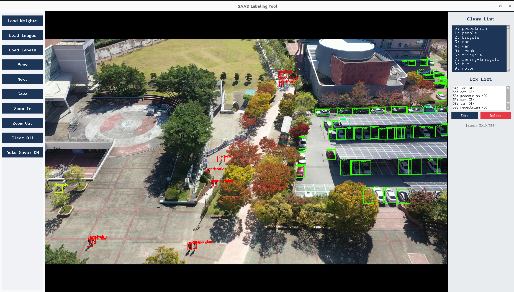

# SAAD-SR Dataset

This repository contains the official dataset and benchmark utilities for the paper:

**SAAD-SR: A Scale-Aware Aerial Benchmark for Learning Robust Object Representations Under UAV-Induced Scale Shifts**

SAAD-SR is designed to evaluate object detection robustness in aerial scenarios with altitude-induced scale variation and environmental diversity. The dataset includes:

- Discretized UAV telemetry (altitude-stratified views)
- Multi-condition image sequences (day, night, snow, haze)
- Altitude-specific annotations
- Per-class statistics
- Tools for image extraction, label generation, and human-in-the-loop correction

---
## SAD-SR dataset 
samples from SAAD-SR dataset


## 🔗 Dataset Download

> 📦 http://192.168.63.98:5000/sharing/e9M5ZYPbo
## 💾 Trained Models

> 🧠 http://192.168.63.98:5000/sharing/6MiDeGJ5c

---

## Repository Structure

```bash
.
├── data.py         # Extract frames from aerial videos
├── annotator.py    # Predict labels using pretrained YOLO/RT-DETR weights
├── gui.py          # GUI to correct or verify labels (LabelMe-style)
├── dataset/        # Contains image frames and predicted/corrected labels
├── models/         # Folder for pretrained weights (optional)
├── README.md       # This file
└── requirements.txt
```
## 🔧 Setup

```bash
python3 -m venv saad-sr-env
source saad-sr-env/bin/activate
pip install -r requirements.txt
```
## 📍 Usage
## 1. Extract Image Frames from Aerial Videos
```bash
python3 data.py --video_dir path/to/videos --out_dir dataset/images --fps 1
```
## 2. Generate Labels with Pretrained Weights
```bash
python3 annotator.py --image_dir dataset/images --out_dir dataset/labels --weights models/yolov8-sr.pt

```

## Launches an interactive labeling tool:

 -  View predictions

-   Adjust/add bounding boxes

-  Save corrected annotations


## 3. Launch GUI for Label Correction
```bash
python3 gui.py 

```




Launches an interactive labeling tool:

- View predictions

- Adjust/add bounding boxes

 - Save corrected annotations

-  Designed for efficient correction across altitude variations and weather conditions

## 📊 Benchmark Protocols

Evaluation scripts and trained models will be released shortly. The dataset supports:

 Altitude-aware detection

 ## YOLOv8-SR: Altitude-Aware Detection Model

The YOLOv8-SR model is a customized version of YOLOv8 with scale-awareness built in via altitude conditioning. This is achieved by fusing altitude information with intermediate features in the detection head to bias predictions according to flight height.

Key features:

- Supports discrete altitude inputs (e.g., 15m, 25m, 45m)

-  Uses Altitude Embedding modules to influence scale-dependent layers

- Improves precision and recall on small objects at high altitudes

- Trained on SAAD-SR with fine-grained annotation consistency

### Steps to train the YOLOv8-SR model

1. Download the ultralytics-yolov8 from [source](https://github.com/ultralytics)
2. **Base framework adapted from [Ultralytics YOLO](https://github.com/ultralytics)**
3. Put all the scripts from YOLO-SR in the corresponding Ultralytics folders  
4. Run the script:

```bash
python3 YOLO-SR/train_YOLO_SR.py


```


##  Scale Robustness Index (SRI)


The Scale Robustness Index (SRI) is a novel metric introduced in SAAD-SR to quantify detection stability across altitude variations.

Definition:

SRI measures how consistently a model detects the same object across changes in altitude. Higher values imply better generalization across scale.

- SRI is computed per class and averaged across scenes

- Evaluates both prediction overlap and instance continuity

- Complements traditional metrics like mAP with altitude sensitivity

This metric enables fair comparison between altitude-aware and conventional detectors.

 

 Weather-conditioned generalization

 Scale Robustness Index (SRI)


 ```bash
python3 YOLO-SR/SRI.py


```

## 🧾 Citation

If you use this dataset or benchmark in your research, please cite:

> **Shin, Soo Young and Imad, Muhammad and Imad, Muhammad and Imad, Muhammad**,  
> *Saad-SR: A Scale-Aware Aerial Benchmark for Learning Robust Object Representations Under UAV-Induced Scale Shifts.*  
> Available at SSRN: [https://ssrn.com/abstract=5388579](https://ssrn.com/abstract=5388579)  
> or [http://dx.doi.org/10.2139/ssrn.5388579](http://dx.doi.org/10.2139/ssrn.5388579)

```bibtex
@article{shin5388576saad,
  title={Saad-Sr: A Scale-Aware Aerial Benchmark for Learning Robust Object Representations Under Uav-Induced Scale Shifts},
  author={Shin, Soo Young and Imad, Muhammad},
  journal={Available at SSRN 5388576}
}
